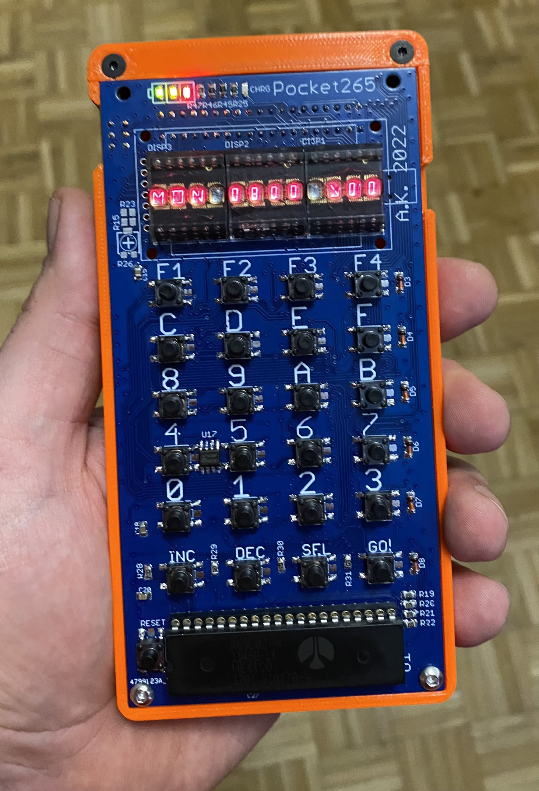
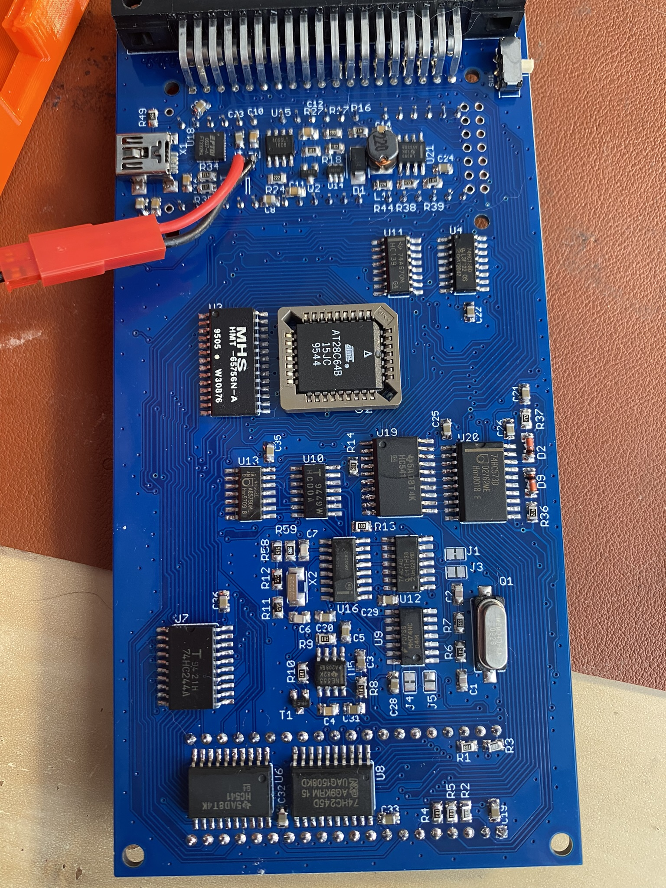

# Pocket265

Handheld PC based on the original 6502 CPU that fits into a pocket.

 

## Features

- 12 digid 16-segment LED display (DL1414),
- optional 8x2 standard LCD (not supported yet in FW),
- 24 button keyboard,
- 8 KB of ROM and 8 KB of RAM,
- I2C 24xx EEPROM memory (16 bit addressing, up to 64 KB),
- built-in Li-Po power supply, charger and visual voltage indicator,
- monitor FW that allows memory edit and running user programs,
- expansion slot with 5 chip selects (up to 40 KB of external I/O and/or memory),
- based on my Pocket65 project (github.com/agkaminski/Pocket65) with partial compability.

# Memory map

| Start  | End    | Description |
|--------|--------|-------------|
| 0x0000 | 0x1FFF | RAM         |
| 0x2000 | 0x3FFF | External 1  |
| 0x4000 | 0x5FFF | External 2  |
| 0x6000 | 0x7FFF | External 3  |
| 0x8000 | 0x9FFF | External 4  |
| 0xA000 | 0xBFFF | External 5  |
| 0xC000 | 0xC3FF | Keyboard    |
| 0xC400 | 0xC7FF | Screen      |
| 0xC800 | 0xCBFF | NMI ack     |
| 0xCC00 | 0xCFFF | 4 bit GPIO  |
| 0xE000 | 0xFFFF | ROM         |

# Monitor how-to

## Startup

First, welcome splash-screen is displayed:

> POCKET265

After that version and copyright information is scrolled over and memory test is performed:

> 6144 B FREE

By default 6144 bytes are free (2 KB is reseved for ROM), memory can be expanded using expansion slot.

After 1 seconds computer proceeds to the main mode of operation:

> MON 0800 >00

## Memory edit

In the main mode and byte modification selected (`>` pointing to the memory value) memory modification is possible. To modify memory press a key `0` to `F`. The old value is then shifted 4 binary places to the left and new nibble is inserted at the youngest position. Previous 4 oldest bits are lost.

Example - entering `0xBA` at the current address:

We start with our memory cell selected (in this case at the address `0x0800`):

> MON 0800 >00

press `B` button to enter 0xB:

> MON 0800 >0B

then press `A` button to finish entering the byte:

> MON 0800 >BA

Done!

## Address selection

The address can be modified in two ways:

### INC/DEC buttons

To select next/prev memory cell press `INC`/`DEC` button. The address will be incremented/decremented by one.

### Entering new address

Big leaps through memory space are not very convenient using incrementation/decrementation. You can change the address very similar to changing memory value. To enter address edit mode pres `SEL` key. `<` will point to the address to confirm mode selection:

> MON 0800< 00

In this mode address can be modified the same way memory value is performed - when key `0-F` is pressed the old address is shifted 4 bits to the left and new value is inserted at the youngest position.

To exit address edit mode (and return to the memory value edit mode) press `SEL` key.

## Executing user program

To start user program provides its entry point in the address field and press `GO` button.

## F1 key - auto increment mode

`F1` key toggles auto-increment mode. When on it's indicated by `+` sign next to the address:

> MON 0800+>00

When this mode is active when the whole byte is entered (i.e. two key `0-F` presses) address will be incremented automatically. This mode is very useful for binary program listing input, as no additional key press between bytes is needed.

## F2 key - monitor menu

`F2` displays monitor menu which contains additional functions. To show next item press `INC`, `DEC` for previous. To select item press `GO`.

### 1: COPY MEM

Copy memory. Destination address is an address currently set in monitor. User is prompted for source address end length (both inputed as 4 digit hexadecimal numbers).

### 2: I2C SAVE

Save data to I2C memory. Source address is an address currently set in monitor. User is prompted for device destination address end length (both inputed as 4 digit hexadecimal numbers).

### 3: I2C LOAD

Load data from I2C memory. Destinatio address is an address currently set in monitor. User is prompted for device source address end length (both inputed as 4 digit hexadecimal numbers).

### 4: UART COM

Begin serial comunication (available on the USB port via USB-UART bridge). 200 baud, 1 stop, no parity. Communication is very similar to pressing keys on the keyboard and it's mostly dedicated for scripting. Each valid char is echoed back, data stream should be slow (i.e. sender should wait for echo before sending next byte, as UART is performed via bitbang and half-duplex only). Valid characters:

- `0-9`, `a-f`, `A-F` - hex numbers to set address/data,
- `@` - set mode to address edit mode,
- `#` - set mode to data edit mode,
- `!` - execute program.

Auto increment mode is always enabled for serial communication.

### 5: VERSION

Display FW version (git hash/tag).

### 6: CLR MEM

Clear user memory (set all bytes to 0).

# Programming

User program examples are provided in `user/example` directory, the user program template is provided in `user` directory along with BIOS calls user library and Makefile.

User is free to use all memory, exluding:

| Start  | End    | Description       |
|--------|--------|-------------------|
| 0x00C0 | 0x00FF | ROM ZP area       |
| 0x0100 | 0x01FF | HW stack          |
| 0x0200 | 0x07FF | RAM for ROM usage |
| 0xC000 | 0xCFFF | HW handled by ROM |

## Interrupts

Interrupt vectors are located in ROM area, so they cannot be changed by application code. Monitor can handle user IRQ and NMI handlers - there are two system calls to register user interrupt handler

- `svc_irqRegister` register the IRQ handler,
- `svc_nmiRegister` register the NMI handler.

The handler address is passed in X (low byte) and Y (high byte) registers.

Use `RTS` instruction to return from the handler insted of `RTI` - monitor handles return from the interrupt part.

## System calls

### Convention

When X, Y registers are used to pass 16-bit value, X holds low byte and Y holds high byte. Syscalls don't destroy unrelated registers/memory

### `svc_irqRegister`

Register user IRQ handler and enables interrupts.

- Arguments: X, Y - handler address.
- Returns: none.

### `svc_nmiRegister`

Register user NMI handler.

- Arguments: X, Y - handler address.
- Returns: none.

### `svc_putch`

Displays ASCII character on the screen.

- Arguments: A - character.
- Returns: none.

### `svc_puts`

Displays null-terminated ASCII string on the screen.

- Arguments: X, Y - string address.
- Returns: none.

### `svc_putb`

Display a hex byte on the screen.

- Arguments: A - byte.
- Returns: none.

### `svc_prinxU16`

Print 16-bit number in registers X, Y.

- Arguments: X, Y - number.
- Returns: none.

### `svc_printdU16`

Print 16-bit number in registers X, Y as unsigned decimal number.
- Arguments: X, Y - number.
- Returns: none.

### `svc_printdS16`

Print 16-bit number in registers X, Y as signed decimal number.

- Arguments: X, Y - number.
- Returns: none.

### `svc_scanxU16`

Get 16-bit unsigned number from the user (hexadecimal input).

- Arguments: X, Y - ASCII string (prompt).
- Returns: X, Y - number.

### `svc_scandU16`

Get 16-bit unsigned number from the user (decimal input).

- Arguments: X, Y - ASCII string (prompt).
- Returns: X, Y - number.

### `svc_getKey`

Get key code - block until new key is pressed.

- Arguments: none.
- Returns: A - key code.

### `svc_getKeyNb`

Get current key code.

- Arguments: none.
- Returns: A - key code.

### `svc_getJiffies`

Get current miliseconds value (one byte).

- Arguments: none.
- Returns: A - jiffies.

### `svc_getSeconds`

Get current seconds value (one byte).

- Arguments: none.
- Returns: A - seconds.

### `svc_msleep`

Sleep for 0-255 ms.

- Arguments: A - time (ms).
- Returns: none.

### `svc_sleep`

Sleep for 0-255 s.

- Arguments: A - time (s).
- Returns: none.

### `svc_nmiDisable`

Disable NMI.

- Arguments: none
- Returns: none.

### `svc_nmiStart`

Restart NMI.

- Arguments: none.
- Returns: none.

# License

Free for non-commercial use and educational purposes. See LICENSE.md for details.
