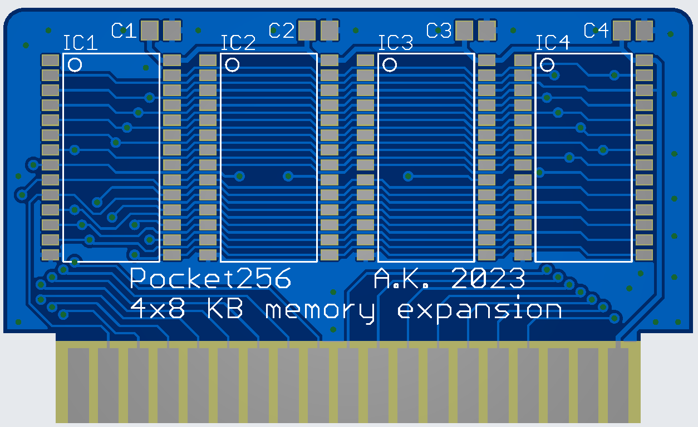

# 8/16/24/32 KB RAM expansion board

This expansion board expands Pocket265 RAM. The same IC used for internal memory has been used.
Using this board Pocket265 can have up to 40 KB of RAM in total.
RAM can be expanded up to 32 KB, although smaller number of chips can be installed.
Start with IC1 (8 KB), then IC2 (16 KB), IC3 (24 KB) and finally IC4 (max of 32 KB).
