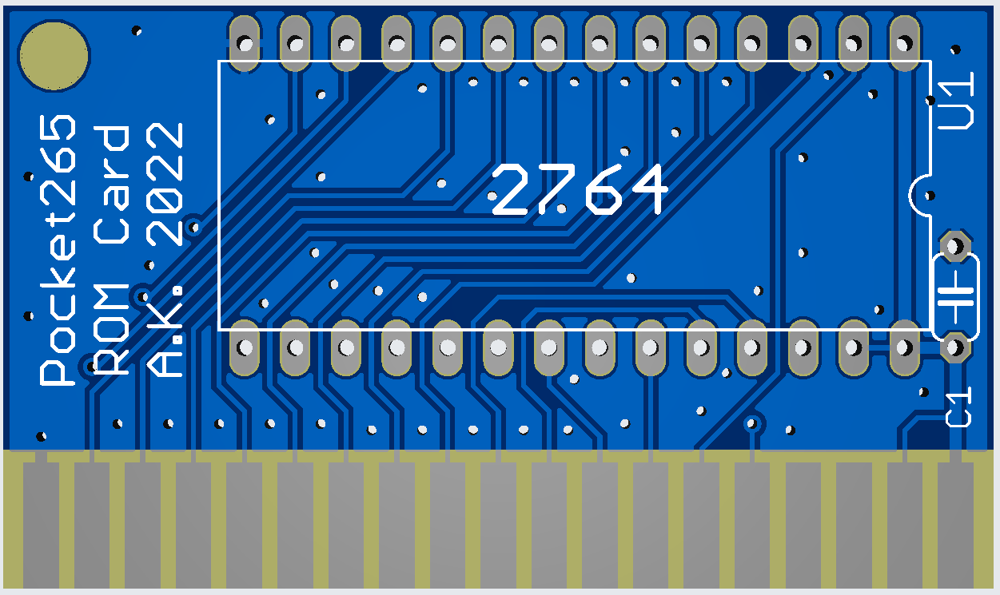

# 8 KB ROM cartrige

This expansion board allows for permanent storage of the Pocket265 software and instant access to it.
ROM (2764 EPROM) is accessed via external chip select #5 (addresses 0xA000-0xBFFF).
There is no facicility to reprogram the EPROM in the cartrige, chip has to be prepared before being soldered in (or placed in a socket).
